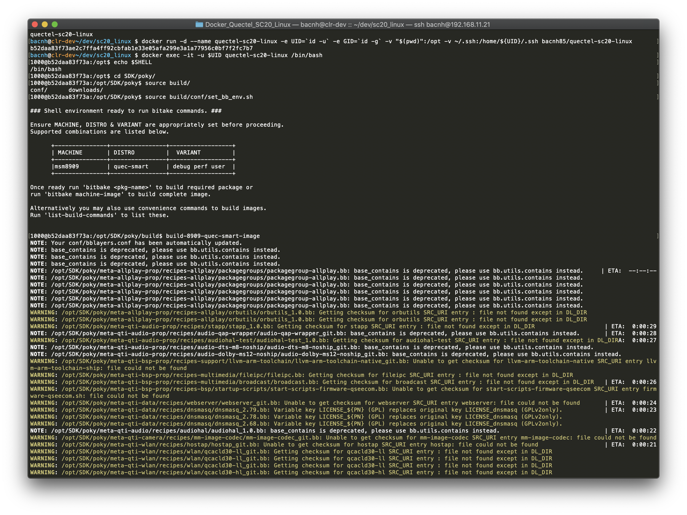

## What is this image?

[`bacnh85/quectel-sc20-linux`](https://hub.docker.com/r/bacnh85/quectel-sc20-linux) is a docker image for building Quectel SC20 Linux SDK.

[Quectel SC20](https://www.quectel.com/product/sc20.htm) is a Quectel Smart Module based on Qualcomm Snapdragon MSM8909, Quad-core A7, up to 1.1GHZ. It has rich peripherals (Wifi, BT, GNSS, support LCM, Camera, ... ). SC20 supports Android 7.1.2, Android 8.0.1 or a Linux based on Yocto.

Embedded Linux is the best suitable for IoT application like IoT gateway, ...

In order to obtain SC20 Linux SDK, pls help to coordinate with your local FAE and sales in your region. Then you will have access to [SC20 Linux SDK](https://gitlab.quectel.com:8080/quectel_smart/sc20_linux).



## Prepare

1. Install [docker and docker-compose](https://docs.docker.com/get-docker/)
2. Obtain access to SC20 Linux SDK, just add your public key to [your profile](https://gitlab.quectel.com:8080/profile/keys).

If you don't have access to SC20 Linux SDK, then this repo is not for you.

3. Your SC20 Linux working directory: this is where Linux SDK is stored. So you can access it from the host or use your favourite editor like VSCode. Let's assump it is: `~/sc20_linux/` which is located inside your home directory.

## Usage

1. Pull the docker image:

```
docker pull bacnh85/quectel-sc20-linux
```

2. Create a working directory to store all SDK and build stuff:

```
mkdir ~/sc20_linux
cd ~/sc20_linux
```

Then, create a container that mount the current directory to `opt` folder as well as `ssh` folder so the container itself is able to clone SDK by itself.

```
docker run -d --name quectel-sc20-linux -e UID=`id -u` -e GID=`id -g` -v "$(pwd)":/opt -v ~/.ssh:/home/${UID}/.ssh bacnh85/quectel-sc20-linux
```

3. Compile SC20 Linux image

Goto the container shell with same ID as host:

```
docker exec -it -u $UID quectel-sc20-linux /bin/bash
```

As SC20 SDK is pulled by the container, there is a `SDK` folder in `/opt` folder inside container as well as in your working directory. Pls wait for a while as container is pulling SDK (about 552MB).

```
1000@4632dbf7dd7e:/opt$ tree -L 2
.
└── SDK
    ├── android_compat
    ├── audio
    ├── bootable
    ├── bt-proprietary
    ├── camera
    ├── data
    ├── data-ipa-cfg-mgr
    ├── data-kernel
    ├── data-oss
    ├── device
    ├── diag
    ├── display
    ├── disregard
    ├── external
    ├── ffmpeg_video
    ├── filesystems
    ├── frameworks
    ├── fs-scrub-daemon
    ├── gps
    ├── hardware
    ├── kernel
    ├── mbim
    ├── mcm-api
    ├── mcm-core
    ├── mcm-gps
    ├── mdm-init
    ├── mdm-ss-mgr
    ├── OTA
    ├── pmipv6
    ├── poky
    ├── prebuilt_HY11
    ├── qcom-opensource
    ├── qmi
    ├── qmi-framework
    ├── qtmultimedia
    ├── quectel-app
    ├── quectel-core
    ├── remotefs
    ├── shortcut-fe
    ├── syncbuild.sh
    ├── synergy-bt-proprietary
    ├── system
    ├── tcp-splice
    ├── tftp
    ├── thermal-engine
    ├── time-services
    ├── vendor
    ├── video
    ├── wlan
    └── wlan-proprietary

50 directories, 1 file
```

Then, straight forward to build your SC20 Linux followed the Quectel documents.

```
$ cd SDK/poky
$ source build/conf/set_bb_env.sh
$ build-8909-quec-smart-image
```

You may need to adjust BB_NUMBER_THREADS, PARALLEL_MAKE to reflect your horse PC.

## Ugrade image

To upgrade image, pls follow below instruction:

```
docker pull bacnh85/quectel-sc20-linux
```

Then, delete the old container:
```
docker stop quectel-sc20-linux
docker rm quectel-sc20-linux -v
```

Then, follow the steps above to create container.

## Usage - using Docker Compose

For your convience, I have created a [Github repo](https://github.com/bacnh85/Docker_Quectel_SC20_Linux.git) contains [`docker-compose.yml`] (docker-composer.yml) and needed scripts.

```
git clone https://github.com/bacnh85/Docker_Quectel_SC20_Linux.git
cd Docker_Quectel_SC20_Linux
```

Then, start the docker container and go to the shell:

```
sh start.sh
```

Inside the docker container, folder is organized as below:

```
bacnh@17e4be739562:/opt$ tree -L 1
.
├── docker-compose.yml    
├── Dockerfile
├── docs                  <--- Documents
├── README.md
├── script                <--- Scrips for working with SC20 Linux
├── SDK                   <-- SC20_Linux SDK
└── start.sh
```

Then, straight forward to build your SC20 Linux followed the Quectel documents.

```
$ cd SDK/poky
$ source build/conf/set_bb_env.sh
$ build-8909-quec-smart-image
```

### Usage for Mac users

For Mac users, there could be many errors due to different file system, ... , volume mount is still the best approach:
- Configure the build to store build data into volume mount
- Sync output data into build folder

Therefore, folder is oragnized as below:

```
bacnh@17e4be739562:/opt$ tree -L 1
.
├── build                 <-- Volume mount folder     (for Mac users)
├── deploy                <-- Output of build process (for Mac users)
├── docker-compose.yml
├── Dockerfile
├── docs                  <--- Documents
├── images                <--- All images for SC20 modules, ... (for Mac users)
├── README.md
├── script                <--- Scrips for working with SC20 Linux
├── SDK                   <-- SC20_Linux SDK
└── start.sh
```

1) Modify the local.conf

Copy modified local.conf from scripts folder to SDK/poky/build/conf/local.conf folder and adjust BB_NUMBER_THREADS, PARALLEL_MAKE based on your PC's configuration.

```
$ cp script/local.conf SDK/poky/build/conf/local.conf
```

What I have done:

a) Change SSTATE_DIR and TMPDIR to build folder

- SSTATE_DIR ?= "/opt/build/sstate-cache"
- TMPDIR = "/opt/build/tmp"


2) Build the image

Inside docker container, you can build SC20 Linux, just follow the Quectel getting started manual.

```
$ cd SDK/poky
$ source build/conf/set_bb_env.sh
$ build-8909-quec-smart-image
```

Output of the build is inside /opt/build folder.

3) Sync the result

Inside the docker, run the sync script to sync data from build folder to deploy folder.

*Note*: You are runnign below command inside the docker container

```
$ cd /opt
$ sh sh script/sync.sh
```

Content inside deploy folder look like this:

```
bacnh@17e4be739562:/opt$ tree deploy -L 1
deploy
├── images
├── ipk
└── licenses
```

## Development

For development, pls follow below steps:

```
git clone https://github.com/bacnh85/Docker_Quectel_SC20_Linux
cd Docker_Quectel_SC20_Linux
docker build docker-image -t bacnh85/quectel-sc20-linux
```

In fact, you can always clone my repo and adjust your need or use my created scripts.